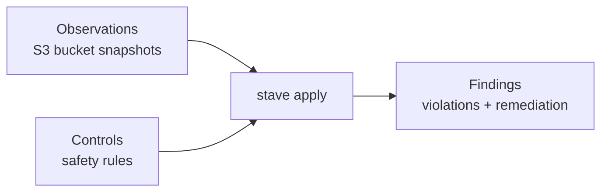

# Stave Tutorial Demo

44 S3 security scenarios in Docker. No AWS credentials required.

## Install

```bash
git clone https://github.com/sufield/stave.git
cd stave
docker build -f build/docker/demo/Dockerfile -t stave-tutorials ..
```

## Run your first scenario

```bash
docker run --rm stave-tutorials --scenario 1
```

This detects a publicly readable S3 bucket. The output shows the
observation, the command, and the violation.

Add `--fixed` to see the remediated version pass.

## See all 44 scenarios

```bash
docker run --rm stave-tutorials --list
```

Pick any number from 1 to 44.

## HIPAA compliance profile

```bash
docker run --rm stave-tutorials --hipaa
```

Evaluates a PHI bucket against 14 HIPAA controls with compound risk
detection. Add `--fixed` to see all controls pass.

## Trusted Advisor blind spots

```bash
docker run --rm stave-tutorials --blind-spots
```

Three S3 risks that AWS Trusted Advisor cannot detect.

## Try with your own bucket

```bash
docker run --rm stave-tutorials --try-your-own
```

Prints step-by-step instructions to capture a real S3 bucket with
the AWS CLI and evaluate it.

## Scenario reference

### Beginner (1-8)

| # | Control | Severity | Name |
|---|---------|----------|------|
| 1 | CTL.S3.PUBLIC.001 | critical | No Public S3 Bucket Read |
| 2 | CTL.S3.CONTROLS.001 | high | Public Access Block Must Be Enabled |
| 3 | CTL.S3.ENCRYPT.001 | high | Encryption at Rest Required |
| 4 | CTL.S3.LOG.001 | medium | Access Logging Required |
| 5 | CTL.S3.VERSION.001 | medium | Versioning Required |
| 6 | CTL.S3.VERSION.002 | medium | Backup Buckets Must Have MFA Delete Enabled |
| 7 | CTL.S3.GOVERNANCE.001 | low | Data Classification Tag Required |
| 8 | CTL.S3.INCOMPLETE.001 | low | Complete Data Required for Safety Assessment |

### Intermediate (9-27)

| # | Control | Severity | Name |
|---|---------|----------|------|
| 9 | CTL.S3.ENCRYPT.002 | high | Transport Encryption Required |
| 10 | CTL.S3.PUBLIC.007 | critical | No Public Read via Policy |
| 11 | CTL.S3.PUBLIC.003 | critical | No Public Write Access |
| 12 | CTL.S3.ACCESS.002 | high | No Wildcard Action Policies |
| 13 | CTL.S3.ACCESS.003 | high | No External Write Access |
| 14 | CTL.S3.NETWORK.001 | high | Public-Principal Policies Must Have Network Conditions |
| 15 | CTL.S3.PUBLIC.004 | medium | No Public Read via ACL |
| 16 | CTL.S3.ACL.FULLCONTROL.001 | critical | No FULL_CONTROL ACL Grants to Public |
| 17 | CTL.S3.ACL.RECON.001 | high | No Public ACL Readability |
| 18 | CTL.S3.ACL.ESCALATION.001 | high | No Public ACL Modification |
| 19 | CTL.S3.AUTH.READ.001 | high | No Authenticated-Users Read Access |
| 20 | CTL.S3.AUTH.WRITE.001 | high | No Authenticated-Users Write Access |
| 21 | CTL.S3.PUBLIC.LIST.001 | high | No Public S3 Bucket Listing |
| 22 | CTL.S3.PUBLIC.LIST.002 | high | Anonymous S3 Listing Must Be Explicitly Intended |
| 23 | CTL.S3.PUBLIC.005 | medium | No Latent Public Read Exposure |
| 24 | CTL.S3.PUBLIC.006 | critical | No Latent Public Bucket Listing |
| 25 | CTL.S3.ACCESS.001 | high | No Unauthorized Cross-Account Access |
| 26 | CTL.S3.PUBLIC.002 | critical | No Public S3 Buckets With Sensitive Data |
| 27 | CTL.S3.PUBLIC.PREFIX.001 | high | Protected Prefixes Must Not Be Publicly Readable |

### Advanced (28-43)

| # | Control | Severity | Name |
|---|---------|----------|------|
| 28 | CTL.S3.ENCRYPT.003 | high | PHI Buckets Must Use SSE-KMS with Customer-Managed Key |
| 29 | CTL.S3.ENCRYPT.004 | high | Sensitive Data Requires KMS Encryption |
| 30 | CTL.S3.LIFECYCLE.001 | medium | Retention-Tagged Buckets Must Have Lifecycle Rules |
| 31 | CTL.S3.LIFECYCLE.002 | medium | PHI Buckets Must Not Expire Data Before Minimum Retention |
| 32 | CTL.S3.LOCK.001 | medium | Compliance-Tagged Buckets Must Have Object Lock Enabled |
| 33 | CTL.S3.LOCK.003 | medium | PHI Object Lock Retention Must Meet Minimum Period |
| 34 | CTL.S3.LOCK.002 | medium | PHI Buckets Must Use COMPLIANCE Mode Object Lock |
| 35 | CTL.S3.PUBLIC.008 | critical | No Public List via Policy |
| 36 | CTL.S3.WEBSITE.PUBLIC.001 | critical | No Public Website Hosting with Public Read |
| 37 | CTL.S3.REPO.ARTIFACT.001 | medium | Public Buckets Must Not Expose VCS Artifacts |
| 38 | CTL.S3.WRITE.SCOPE.001 | high | S3 Signed Upload Must Bind To Exact Object Key |
| 39 | CTL.S3.WRITE.CONTENT.001 | high | S3 Signed Upload Must Restrict Content Types |
| 40 | CTL.S3.TENANT.ISOLATION.001 | high | Shared-Bucket Tenant Isolation Must Enforce Prefix |
| 41 | CTL.S3.BUCKET.TAKEOVER.001 | critical | Referenced S3 Buckets Must Exist And Be Owned |
| 42 | CTL.S3.DANGLING.ORIGIN.001 | high | CDN S3 Origins Must Not Be Dangling |
| 43 | CTL.S3.ACL.WRITE.001 | critical | No Public Write via ACL |

### Capstone (44)

| # | Control | Severity | Name |
|---|---------|----------|------|
| 44 | All 47 controls | all | Full Hardening Audit |

## How stave works



## What you now know

By working through these scenarios you have:

- **Seen what an observation looks like** — a JSON snapshot of S3
  bucket configuration captured at a point in time (`obs.v0.1`)
- **Run `stave apply`** — the evaluation engine that checks
  observations against safety controls and reports violations
- **Read a finding** — control ID, severity, affected asset, evidence
  of the misconfiguration, and concrete remediation steps
- **Verified a fix** — the same command on a remediated observation
  produces zero violations (exit code 0)
- **Understood exit codes** — 0 means safe, 3 means violations found
- **Seen compound risks** — how HIPAA profile evaluation detects
  dangerous combinations of control failures
- **Used your own data** — captured a real S3 bucket with the AWS CLI
  and evaluated it with stave
