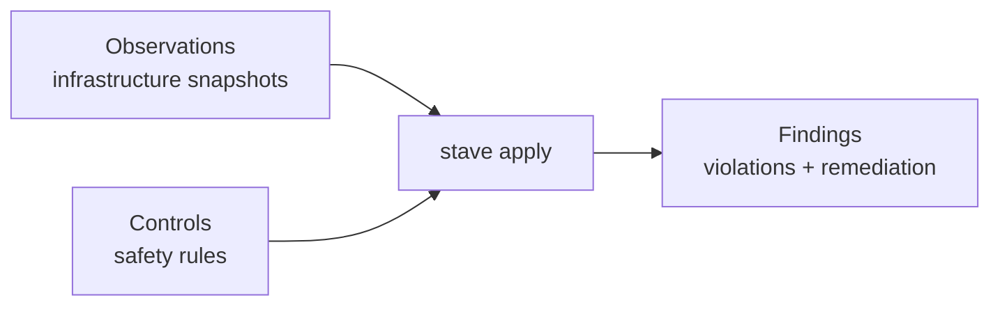

# Stave Tutorial Demo

7 curated S3 misconfiguration scenarios in Docker. No AWS credentials required.

Stave ships with 2816 controls across 78 domains. This Docker demo
covers the S3 domain (112 controls) through 7 curated scenarios that
each exercise a distinct misconfiguration pattern.

## Build

```bash
git clone https://github.com/sufield/stave.git
cd stave
docker compose -f stave/docker-compose.yaml build demo
```

## Detect a misconfiguration

```bash
docker compose -f stave/docker-compose.yaml run --rm demo
```

Runs the default `public-read` scenario. The output shows:
1. The observation — a bucket with a public bucket policy + missing PAB
2. The stave command
3. The findings — three S3 controls fire (public read, missing PAB, ACL exposure)

## See all scenarios

```bash
docker compose -f stave/docker-compose.yaml run --rm demo --list
```

Run any of them by name:

```bash
docker compose -f stave/docker-compose.yaml run --rm demo --scenario public-read
docker compose -f stave/docker-compose.yaml run --rm demo --scenario hipaa-compliance
```

## Pass-through to stave

Any unrecognised arguments are forwarded to the `stave` binary inside
the container:

```bash
docker compose -f stave/docker-compose.yaml run --rm demo --version
docker compose -f stave/docker-compose.yaml run --rm demo doctor
docker compose -f stave/docker-compose.yaml run --rm demo capabilities
```

## Scenario reference

| Scenario | Findings | What it demonstrates |
|----------|---------:|----------------------|
| `public-read` | 3 | Public bucket via policy + ACL + missing PAB |
| `acl-write` | 3 | Write access granted through ACL |
| `acl-escalation` | 5 | ACL privilege-escalation chain |
| `tool-blind-spot` | 2 | Misconfigurations missed by other tools |
| `hipaa-compliance` | 8 | PHI bucket with multiple HIPAA failures |
| `data-governance` | 5 | Data classification and lifecycle gaps |
| `upload-hardening` | 3 | Upload path security controls |

Each scenario runs the same control engine with a different observation
fixture. The fixtures live under
[`docs-content/demo/scenarios/`](../docs-content/demo/scenarios/) — each
has `observations/` (snapshot) and `expected.txt` (golden output).

## Beyond S3: the full catalog

This demo covers S3. Stave evaluates 2816 controls across 78 domains.
Outside Docker, point `stave apply --profile` at any built-in pack with
a bundled observation file:

```bash
# Domain packs
stave apply --profile aws-s3   --input observations.json
stave apply --profile aws-iam  --input observations.json
stave apply --profile aws-efs  --input observations.json
stave apply --profile gcp-gcs  --input observations.json

# Compliance frameworks — same engine, different framework lens
stave apply --profile hipaa          --input observations.json
stave apply --profile soc2           --input observations.json
stave apply --profile cis-aws-v3.0   --input observations.json
stave apply --profile pci-dss-v4.0   --input observations.json
# Also: nist-800-53, fedramp, gdpr, ffiec, iso-27001, nist-csf-2.0
```

The full domain breakdown ships in [`README.md`](README.md) and the
generated catalog at [`docs/controls/reference.md`](docs/controls/reference.md).

## How stave works


```mermaid
graph LR
    A[Observations<br/>infrastructure snapshots] --> C[stave apply]
    B[Controls<br/>safety rules] --> C
    C --> D[Findings<br/>violations + remediation]
```

## What you now know

By working through these scenarios you have:

- **Seen what an observation looks like** — a JSON snapshot of infrastructure configuration captured at a point in time (`obs.v0.1`)
- **Run `stave apply`** — the evaluation engine that checks observations against safety controls and reports violations
- **Read a finding** — control ID, severity, affected asset, evidence of the misconfiguration, and concrete remediation steps
- **Verified a fix** — the same command on a remediated observation produces zero violations (exit code 0)
- **Understood exit codes** — 0 means safe, 3 means violations found
- **Used your own data** — mounted a directory with `--quickstart` so stave evaluates your real snapshots
- **Seen that the same engine spans 74 domains and the full compliance-profile set** — this demo is the S3 subset
