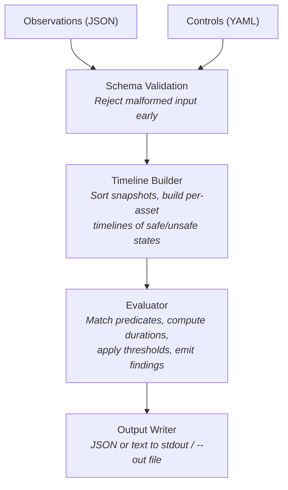
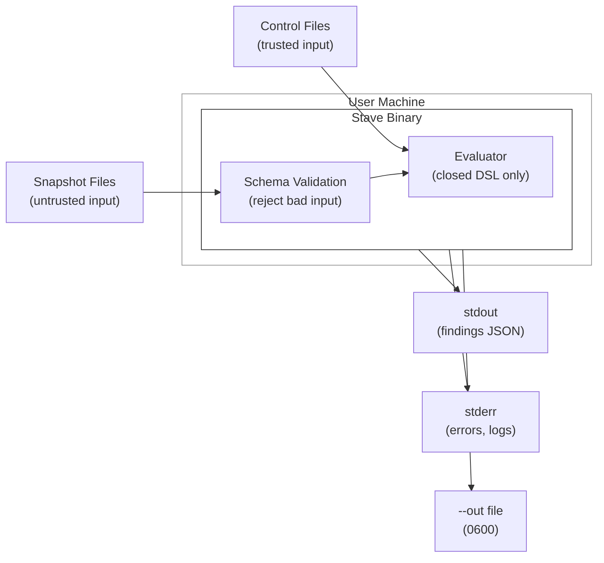

# Architecture Overview

Stave is a single static binary with no plugins, no network, and no persistent state. All evaluation runs as a pure function: files in, findings out.

## Pipeline



## Package Map

```
stave/
├── cmd/stave/              Entry point (main.go)
│   └── cmd/                Cobra command definitions
│       ├── root.go         Global flags, --require-offline, --sanitize, --force
│       ├── evaluate/       apply command tree (handler, options, deps)
│       ├── ingest/         ingest command + profile dispatch
│       ├── validate.go     validate command
│       ├── diagnose.go     diagnose command
│       ├── verify.go       verify command
│       ├── hygiene.go      snapshot hygiene weekly report command
│       ├── fix_loop.go     ci fix-loop remediation lifecycle command
│       ├── capabilities.go capabilities command
│       └── cmdutil/        Shared CLI utilities
│
├── internal/
│   ├── domain/             Core business logic (no I/O)
│   │   ├── evaluator*.go   Evaluation engine
│   │   ├── episode.go      Episode tracking (safe→unsafe transitions)
│   │   ├── duration.go     Duration calculation
│   │   ├── diagnostics*.go Diagnose engine
│   │   └── confidence.go   Finding confidence scoring
│   │
│   ├── predicate/          Predicate operators (15 ops)
│   │
│   ├── app/                Use-case orchestration
│   │   ├── evaluate.go     Wire inputs → evaluator → output
│   │   ├── validate.go     Wire inputs → schema checks
│   │   ├── diagnose.go     Wire inputs → diagnostics
│   │   └── capabilities.go Capabilities query
│   │
│   ├── adapters/
│   │   ├── input/          File loaders (JSON observations, YAML controls)
│   │   └── output/         JSON/text output writers
│   │
│   ├── schema/             Schema validation (obs.v0.1, ctrl.v1 via JSON Schema)
│   ├── sanitize/             --sanitize implementation
│   ├── clierr/             Structured CLI error types
│   ├── cliio/              CLI I/O utilities
│   └── platform/           Platform-specific code (logging, fsutil)
│
├── schemas/       Schema source of truth (JSON Schema files)
├── controls/s3/          S3 control packs (41 YAML files)
└── examples/               Example observations
```

### Layer Rules

- **`domain/`** contains pure business logic with no file I/O, no CLI dependencies, and no external packages beyond the standard library.
- **`app/`** orchestrates use cases by wiring domain logic to adapters. It handles the flow: load inputs → validate → evaluate → format output.
- **`adapters/`** handle all I/O: reading files, parsing formats, writing output.
- **`cmd/`** handles only CLI concerns: flag parsing, exit codes, error formatting.

## Trust Boundaries



> **No network | No exec | No creds | No plugins**

**Input trust levels:**

| Input | Trust Level | Validation |
|-------|-------------|------------|
| Observation files | Untrusted | Full JSON Schema validation, `additionalProperties: false` |
| Control files | Trusted (user-authored or shipped) | YAML Schema validation, operator allowlist |
| CLI flags | Trusted (user-supplied) | Path normalization, bucket name validation |

**Output trust:**

All output is written with restricted permissions (`0700` dirs, `0600` files). Stdout/stderr are the primary output channels; file output only happens when `--out` is passed.

## Command Map

| Command | Entry Point | App Layer | Domain Layer |
|---------|-------------|-----------|--------------|
| `apply` | `cmd/evaluate/` | `app/evaluate.go` | `domain/evaluator*.go` |
| `validate` | `cmd/evaluate/validate/` | `app/validate.go` | `schema/` |
| `diagnose` | `cmd/diagnose/` | `app/diagnose.go` | `domain/diagnostics*.go` |
| `ingest` | `cmd/ingest/` | — | Adapter-level extraction |
| `verify` | `cmd/evaluate/verify/` | — | Before/after comparison |
| `snapshot hygiene` | `cmd/prune/hygiene/` | — | Weekly lifecycle report |
| `ci fix-loop` | `cmd/enforce/fix/` | — | Apply before/after + verification |
| `capabilities` | `cmd/commands.go` | `app/capabilities.go` | — |
| `graph coverage` | `cmd/enforce/graph/` | — | Predicate matching |

## Schema Lifecycle

1. Source-of-truth schemas live in `schemas/` (e.g., `obs.v0.1.schema.json`).
2. `make sync-schemas` copies them to `internal/contracts/schema/embedded/` for embedding.
3. The copied files are gitignored build artifacts.
4. `make build` runs `sync-schemas` automatically.

Schema IDs use `urn:stave:schema:` (not HTTP URLs) to avoid implying network fetching.

## Further Reading

- [Data Flow and I/O](../trust/data-flow-and-io.md) — per-command I/O model
- [Execution Safety](../trust/execution-safety.md) — no-exec guarantees
- [Security Guarantees](../trust/01-guarantees.md) — full guarantee inventory
