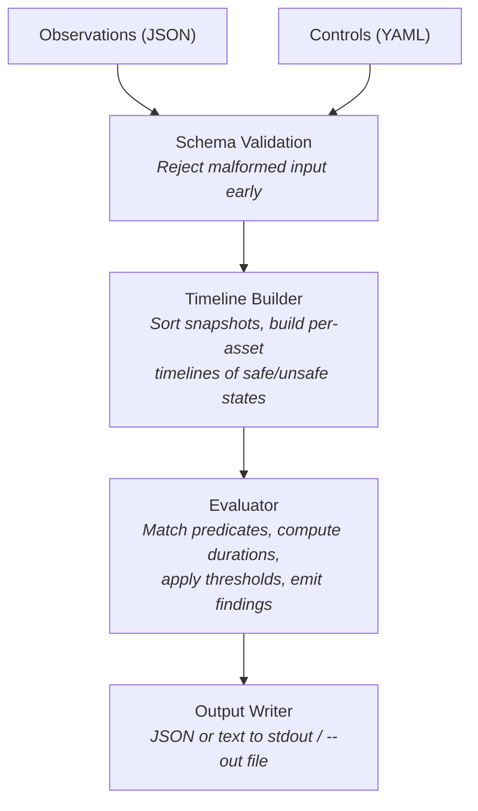
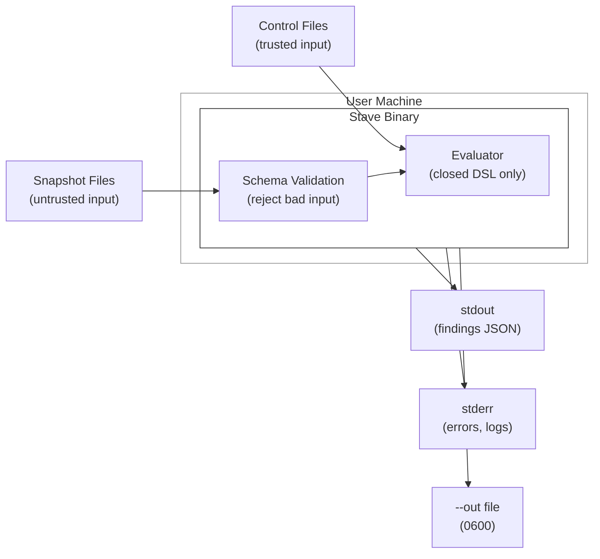

# Architecture Overview

Stave is a single static binary with no plugins, no network, and no persistent state. All evaluation runs as a pure function: files in, findings out.

## Pipeline



## Package Map

```
stave/
├── cmd/stave/              Entry point (main.go)
│   └── cmd/                Cobra command definitions
│       ├── root.go         Global flags, --require-offline, --sanitize, --force
│       ├── apply/          apply command tree (handler, options, deps, validate, verify)
│       ├── diagnose/       diagnose command tree (artifacts, docs, report)
│       ├── enforce/        CI commands (baseline, cidiff, diff, fix, gate, graph)
│       ├── inspect/        inspect command tree (policy, acl, exposure, risk, compliance, aliases)
│       ├── initcmd/        init command (alias, config, context, env)
│       ├── prune/          snapshot lifecycle (archive, cleanup, hygiene, upcoming, plan)
│       ├── bugreport/      bug-report command
│       └── cmdutil/        Shared CLI utilities
│
├── internal/core/       Core business logic (no I/O, importable by adopters)
│   ├── evaluation/         Evaluation engine (engine, exposure, diagnosis, risk, remediation)
│   ├── snapshot/           Snapshot retention planning
│   ├── diag/               Diagnose engine
│   ├── predicate/          Predicate operators (15 ops)
│   ├── asset/              Asset model
│   ├── kernel/             Core domain types
│   ├── policy/             Policy types
│   ├── retention/          Retention policies
│   ├── ports/              Port interfaces
│   ├── maps/               Map parsing utilities
│   ├── s3/                 S3-specific analysis (policy, ACL)
│   └── validation/         Domain validation rules
│
├── internal/
│   ├── app/                Use-case orchestration
│   │   ├── eval/           Wire inputs → evaluator → output (pipeline)
│   │   ├── validation/     Wire inputs → schema checks
│   │   ├── diagnose/       Wire inputs → diagnostics
│   │   ├── capabilities/   Capabilities query
│   │   ├── contracts/      Port interfaces (FindingMarshaler, EnrichFunc, SnapshotFile)
│   │   ├── service/        Shared app services (evaluation, readiness)
│   │   ├── workflow/       Envelope assembly
│   │   ├── hygiene/        Snapshot lifecycle reporting
│   │   └── prune/          Snapshot planning orchestration
│   │
│   ├── adapters/
│   │   ├── controls/       Control loaders (builtin embedded, YAML filesystem)
│   │   ├── observations/   JSON observation snapshot loaders
│   │   ├── evaluation/     Evaluation result loaders
│   │   ├── exemption/      Exemption config loaders
│   │   ├── pruner/         Snapshot filesystem operations (archive, delete, plan apply)
│   │   ├── output/         JSON/text/SARIF output marshalers, DTOs, report rendering
│   │   └── gitinfo/        Git repository metadata
│   │
│   ├── controldata/        Embedded control YAML files (synced from controls/)
│   ├── contracts/          Schema validation (obs.v0.1, ctrl.v1 via JSON Schema)
│   ├── cel/                CEL predicate compiler and evaluator
│   ├── cli/                CLI error types, config, and UI utilities
│   ├── sanitize/           --sanitize implementation + scrub profiles
│   ├── safetyenvelope/     Output envelope types and validation
│   ├── integrity/          Manifest integrity verification
│   ├── compliance/         Compliance mapping
│   ├── config/             Configuration loading
│   ├── builtin/            Embedded control packs and predicate aliases
│   └── platform/           Platform utilities (crypto, fsutil, logging, state)
│
├── schemas/                Schema source of truth (JSON Schema files)
├── controls/s3/            S3 control packs (YAML files)
└── testdata/               Test fixtures and e2e scenarios
```

### Layer Rules

- **`internal/core/`** contains pure business logic with no file I/O, no CLI dependencies, and no `internal/` imports. Importable by adopters.
- **`internal/app/`** orchestrates use cases by wiring domain logic to adapters. It has zero direct dependencies on the adapter layer (enforced by architecture tests with zero exceptions).
- **`internal/adapters/`** handle all I/O: reading files, parsing formats, writing output, filesystem operations.
- **`cmd/`** handles only CLI concerns: flag parsing, exit codes, error formatting. It wires adapters into the app layer via dependency injection.

## Trust Boundaries



> **No network | No exec | No creds | No plugins**

**Input trust levels:**

| Input | Trust Level | Validation |
|-------|-------------|------------|
| Observation files | Untrusted | Full JSON Schema validation, `additionalProperties: false` |
| Control files | Trusted (user-authored or shipped) | YAML Schema validation, operator allowlist |
| CLI flags | Trusted (user-supplied) | Path normalization, bucket name validation |

**Output trust:**

All output is written with restricted permissions (`0700` dirs, `0600` files). Stdout/stderr are the primary output channels; file output only happens when `--out` is passed.

## Command Map

| Command | Entry Point | App Layer | Domain Layer |
|---------|-------------|-----------|--------------|
| `apply` | `cmd/apply/` | `app/eval/` | `internal/core/evaluation/` |
| `validate` | `cmd/apply/validate/` | `app/validation/` | `contracts/` |
| `diagnose` | `cmd/diagnose/` | `app/diagnose/` | `internal/core/diag/` |
| `verify` | `cmd/apply/verify/` | — | Before/after comparison |
| `inspect *` | `cmd/inspect/` | — | `internal/core/s3/`, `evaluation/exposure/`, `evaluation/risk/` |
| `snapshot plan` | `cmd/prune/snapshot/` | `app/prune/snapshot/` | `internal/core/snapplan/` |
| `snapshot hygiene` | `cmd/prune/hygiene/` | `app/hygiene/` | Weekly lifecycle report |
| `ci fix-loop` | `cmd/enforce/fix/` | — | Apply before/after + verification |
| `capabilities` | `cmd/commands_dev.go` | `app/capabilities/` | — |
| `graph coverage` | `cmd/enforce/graph/` | — | Predicate matching |

## Schema Lifecycle

1. Source-of-truth schemas live in `schemas/` (e.g., `obs.v0.1.schema.json`).
2. `make sync-schemas` copies them to `internal/contracts/schema/embedded/` for embedding.
3. The copied files are gitignored build artifacts.
4. `make build` runs `sync-schemas` automatically.

Schema IDs use `urn:stave:schema:` (not HTTP URLs) to avoid implying network fetching.

## Further Reading

- [Data Flow and I/O](../trust/data-flow-and-io.md) — per-command I/O model
- [Execution Safety](../trust/execution-safety.md) — no-exec guarantees
- [Security Guarantees](../trust/01-guarantees.md) — full guarantee inventory
