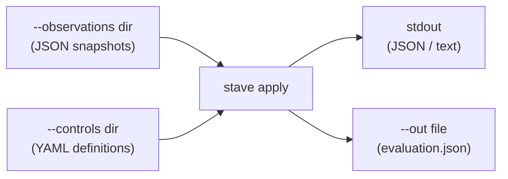
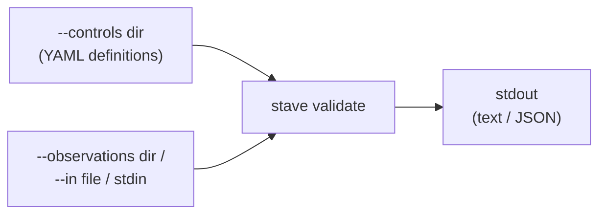

# Data Flow and I/O

Stave is stateless. Every command reads from files or stdin, writes to stdout/stderr or files, and exits. No temp files, no config directories, no caches.

## Per-Command I/O

| Command | Inputs | Outputs | Default Write Behavior |
|---------|--------|---------|----------------------|
| `apply` | `--controls` dir, `--observations` dir, optional `--integrity-manifest` file, optional `--integrity-public-key` file | stdout (JSON/text), optional `--out` dir → `evaluation.json` | stdout primary; `--out` creates dir (0700) and file (0600) |
| `apply --profile mvp1-s3` | `--input` observations file | stdout (JSON/text) | stdout only |
| `validate` | `--controls` dir, `--observations` dir, or `--in` file/`-` (stdin) | stdout (text/JSON) | stdout only |
| `diagnose` | `--controls` dir, `--observations` dir, `--previous-output` file or `-` (stdin) | stdout (text/JSON) | stdout only |
| `verify` | `--before` dir, `--after` dir, `--controls` dir | stdout (JSON), optional `--out` dir → `verification.json` | stdout primary; `--out` creates dir (0700) and file (0600) |
| `snapshot hygiene` | `--controls` dir, `--observations` dir, optional `--archive-dir` dir | stdout (markdown), optional `--out` file | stdout primary; `--out` creates dir (0700) and file (0600) |
| `ci fix-loop` | `--before` dir, `--after` dir, `--controls` dir | stdout (JSON), optional `--out` dir → `evaluation.before.json`, `evaluation.after.json`, `verification.json`, `remediation-report.json` | stdout primary; `--out` creates dir (0700) and files (0600) |
| `ingest --profile mvp1-s3` | `--input` snapshot dir | `--out` file (default: `observations.json`) | Refuses overwrite without `--force`; file perms 0600 |
| `enforce` | `--in` evaluation JSON file | `--out` dir → `enforcement/aws/pab.tf` or `scp.json` | Creates dir (0700) and file (0600) |
| `capabilities` | (none) | stdout (JSON) | stdout only |
| `graph coverage` | `--controls` dir, `--observations` dir | stdout (DOT/JSON) | stdout only |

### Visual: Core Command Data Flows

**apply**

**validate**

## Permission Model

All output directories and files are created with restricted permissions:

- **Directories**: `0700` (owner read/write/execute only)
- **Files**: `0600` (owner read/write only)

This prevents other users on the system from reading evaluation results, enforcement artifacts, or observation data that may contain infrastructure details.

Logging configuration (`config.go`) uses `0644` for log files, which are less sensitive and may need aggregation.

## Overwrite Protection

All write commands refuse to overwrite existing files by default. Use `--force` to allow overwriting.

The `--force` flag is available globally and also as a per-command flag on `ingest --profile mvp1-s3`.

## Symlink Protection

All write commands refuse to write through symbolic links by default. This prevents symlink-based attacks where an attacker places a symlink at the output path.

Use `--allow-symlink-output` (global flag) to override this protection when needed.

## Path Normalization

All user-supplied paths from CLI flags (`--out`, `--controls`, `--observations`, `--input`, `--log-file`) are cleaned with `filepath.Clean` to normalize `.`/`..` segments and duplicate separators. This is done early in command execution before any file I/O.

Integrity paths (`--integrity-manifest`, `--integrity-public-key`) are normalized the same way and validated as files before evaluation starts.

## Dry-Run

The `--dry-run` flag is available on commands that modify the filesystem:

- `ingest --profile mvp1-s3 --dry-run` — prints planned output path, creates no files
- `enforce --dry-run` — prints planned artifact path, creates no files
- `snapshot prune --dry-run` — lists snapshots that would be deleted, removes nothing
- `snapshot archive --dry-run` — lists snapshots that would be moved, moves nothing

Dry-run validates all inputs (reads and parses input files, checks flags) before printing the planned operations. Only file creation/deletion/move is skipped.

Both `snapshot prune` and `snapshot archive` default to dry-run when neither `--dry-run` nor `--force` is specified, preventing accidental data loss.

## Stdin Convention

`-` means stdin for input flags:

- `apply --observations -` — read observation JSON from stdin
- `validate --in -` — read a single file (observation or control) from stdin
- `diagnose --previous-output -` — read evaluation JSON from stdin

`apply --integrity-manifest` is directory-mode only and cannot be combined with `--observations -`.

## Persistence

Stave creates **no persistent state**:

- No temp files
- No config directories (`~/.stave`, `~/.config/stave`, etc.)
- No caches or databases
- No lock files
- No IPC sockets

The only filesystem writes are explicit output files requested by the user via `--out` flags.
